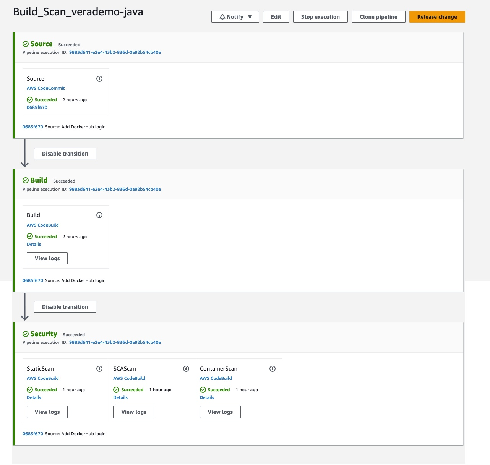
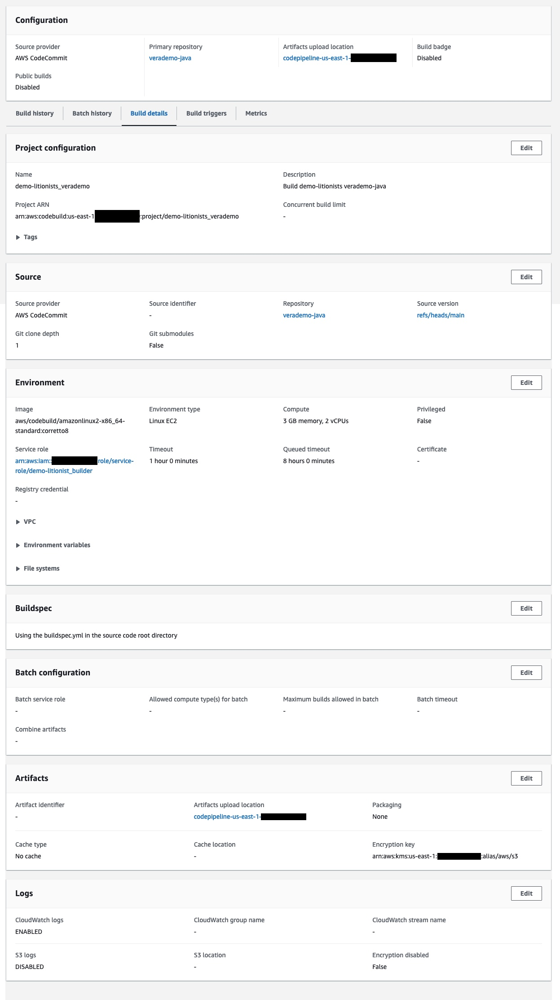
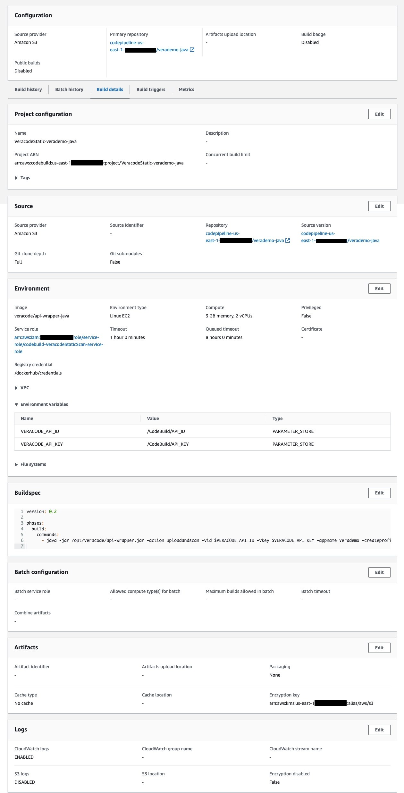
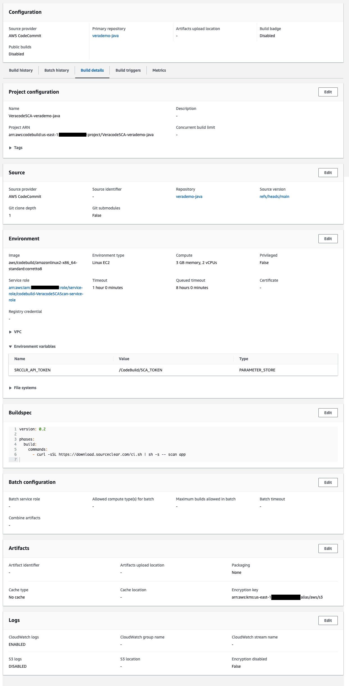
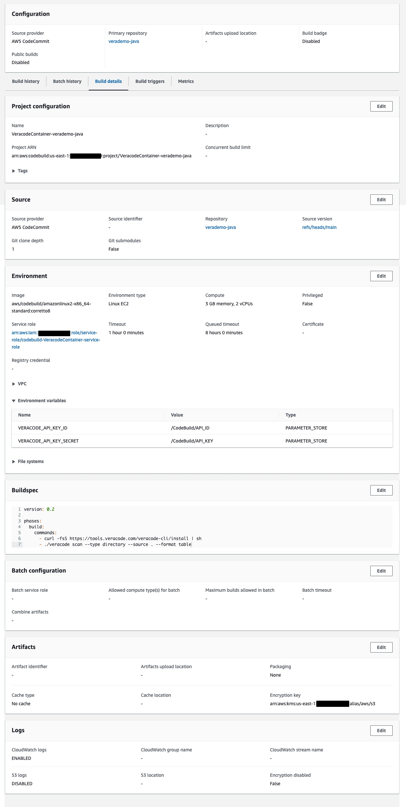

## Using AWS CodeStar

Scanning an application with Veracode involves configuring a CodePipeline to perform the required CodeBuild steps.  This is outlined below.

## Setup

### Clone (into CodeCommit)

Create a repository in AWS CodeCommit and clone this repo into your new CodeCommit repo.

### Configure secrets in the Parameter Store

We will be using the AWS System Manager Parameter Store to hold various credentials.  Configure the following secrets:

* /CodeBuild/API_ID = your Veracode API ID
* /CodeBuild/API_KEY = your Veracode API Key
* /CodeBuild/SCA_TOKEN = your SCA Agent token

### Configure Docker login in the Secrets Manager

DockerHub has limited pull requests for non-authenticated users.  In order to avoid hitting these limits, we'll configure our DockerHub login credentials in the AWS Secrets Manager.  

Create a new Secret in the AWS Secrets Manager - let's call it "/docker/credentials".  Add the following two key/value pairs to this secret:

* key = `username`, value = your DockerHub username
* key = `password`, value = your DockerHub password

## CodePipeline

We will create a CodePipeline to perform the following CodeBuild jobs:

* Build the application
* Do the Veracode static scan
* (optional) Do the Veracode SCA scan
* (optional) Do the Veracode Container scan

This is an overview of the Pipeline we'll be creating:

 

### Create the Pipeline to Build the application

Create a CodePipeline with the following settings (take the defaults unless otherwise specified):

* Source: your CodeCommit repo
	* Branch: main
	* Output artifact format: Full clone
* Build: AWS CodeBuild, create a project with the following settings:
	* Source: your CodeCommit repo
	* Environment: Managed Image, Amazon Linux 2, x86_64-standard:corretto8
		* Service role as required to build (likely the default is OK)
	* Buildspec: use a Buildspec file (the existing `buildspec.yml` file in the repo will be used by default)
	* Artifacts: upload to the S3 bucket associated with the CodePipeline
		* Packaging: None
* Deploy: Skip this stage

Here is a summary of the CodeBuild configuration:

Run and test the CodePipeline.  The app should build and the `verademo.war` file should be placed in the specified S3 bucket.

### Add the Veracode static scan Action

Edit your CodePipeline and add a stage called "Security"

Edit this Security stage and add an Action called "StaticScan"

* Action name = "StaticScan"
* Action provider = AWS CodeBuild, create a project with the following settings:
	* Source: the artifact (verademo.war) file from the S3 bucket
	* Environment: Custom image
		* Environment type: Linux EC2
		* Other registry
		* External registry URL: veracode/api-wrapper-java
		* Registry credentials: the name or ARN of your DockerHub credentials from the AWS Secrets Manager
		* Service role as required to build (likely the default is OK)
			* Note: you might need to add permission for the Service Role to read the Secrets Manager.  There is a pre-defined "SecretsManagerReadWrite" role which can be used, although this is too permissive for real-world use.  Alternately, a read-only permission can be created and used.
		* Environment variables, add the following:
			* `VERACODE_API_ID` = name of the appropriate Parameter Store secret created above
			* `VERACODE_API_KEY` = name of the appropriate Paramter Store secret created above
	* Buildspec: Insert build commands
		* Easy way is to switch to 'edit mode', delete the existing template, and paste the build commands from this repo's `aws/buildspec-veracode-static.yml` file
	* Artifacts: None

Here is a summary of the CodeBuild configuration:

Run and test the CodePipeline.  The verademo.war file should be uploaded to Veracode and a static scan initiated.	

### Add the Veracode SCA scan Action

Edit the Security stage and add an Action called "SCAScan"

* Action name = "SCAScan"
* Action provider = AWS CodeBuild, create a project with the following settings:
	* Source: AWS CodeCommit, this repo
	* Environment:  Managed Image, Amazon Linux 2, x86_64-standard:corretto8
		* Service role as required to build (likely the default is OK)
		* Environment variables, add the following:
			* `SRCCLR_API_TOKEN` = name of the appropriate Parameter Store secret created above
	* Buildspec: Insert build commands
		* Easy way is to switch to 'edit mode', delete the existing template, and paste the build commands from this repo's `aws/buildspec-veracode-sca.yml` file
	* Artifacts: None

Here is a summary of the CodeBuild configuration:

Run and test the CodePipeline.  

### Add the Veracode container scan Action

Edit the Security stage and add an Action called "ContainerScan"

* Action name = "ContainerScan"
* Action provider = AWS CodeBuild, create a project with the following settings:
	* Source: AWS CodeCommit, this repo
	* Environment:  Managed Image, Amazon Linux 2, x86_64-standard:corretto8
		* Service role as required to build (likely the default is OK)
		* Environment variables, add the following:
			* `VERACODE_API_KEY_ID` = name of the appropriate Parameter Store secret created above
			* `VERACODE_API_KEY_SECRET` = name of the appropriate Parameter Store secret created above
	* Buildspec: Insert build commands
		* Easy way is to switch to 'edit mode', delete the existing template, and paste the build commands from this repo's `aws/buildspec-veracode-container.yml` file
	* Artifacts: None

Here is a summary of the CodeBuild configuration:

Run and test the CodePipeline. 

